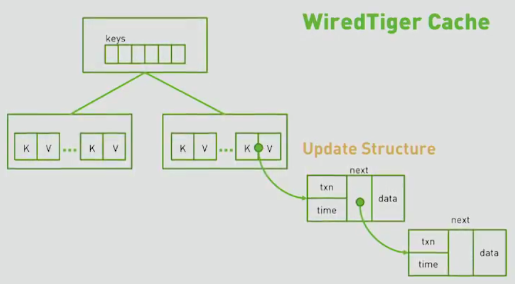
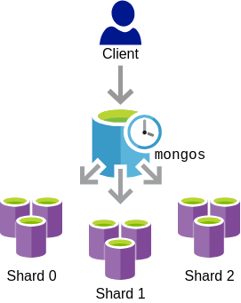

# MongoDB Transactions

Transactions have been introduced in MongoDB 4.0 with a limited support on replica sets only, from version 4.2 they are available in sharded clusters too. This feature was the result of 9 years of research and development from the MongoDB team, but the surprising fact is that performances of non-transactional operations were not degraded even after this additional complexity in the core logic. Essentially, upgrading to a transactions-supporting version of MongoDB would not make your application less performant. 

The purpose of this article is to explain what you can do with (and without) transactions in order to do the best choice in your production environment. Assuming you already know what a transaction is, I am starting with ACID properties and how MongoDB is able to guarantee them inside a transaction.

---

## ACID Properties

As I said, MongoDB Transactions gaurantee ACID properties, which are:

- **A**tomicity: all the operations in a transaction are committed or none of them are. This was made possible thanks to the integration of the WiredTiger storage engine, that uses a snapshot-based cache.
- **C**onsistency: a transaction, when committed, cannot bring the database to an invalid state. 
- **I**solation: isolation ensures that concurrent transactions cannot interfere with each other and with outside operations. In particular, MongoDB transaction operations are invisible until committed and many of the isolations problem can be solved using the appropriate `readConcern` configuration property.
- **D**urability: this property simply guarantee that, once a transaction commits, its changes are not lost even after a system failure. MongoDB lets you configure the durability by setting the `writeConcern` property.

---

## Atomicity

Atomicity is a very difficult requirement in a NoSQl database like MongoDB. A reason could be that one of the priority of a NoSQL database is scaling: ensuring atomicity for a transaction that involves many shards is definitely more complex than doing it for a single node. So, what are the protagonists that made this implementation possible?

### Wired Tiger Cache

The transaction path started when MongoDB team was using MMapV1, which provided ACID properties in a non-multi-document and non-multi-collection transaction. Next, they decided to integrate WiredTiger as the primary storage layer and it is currently the default and the only one supporting transactions. This storage engine leverages an internal in-memory cache to store changes from the moment when the transaction started, before flushing them to disk.

WiredTiger stores all data, that can be a document or part of an index, in a tree of keys and values, like represented in the following image:



When any transactional updates are made to a key's value, WiredTiger creates an update structure, invisible from the outside because not yet committed, containing the data changed and a pointer on to any later changes. Later update structures will append themselves to the previous update structure creating a chain of different versions of the value over time. The multiversion concurrency control I am going to talk about later is internally implemented using this tree structure. To preserve the MongoDB order within the WiredTiger storage engine, the update structure was extended with a "timestamp" field, that is used to get the exact state of the data when queried. Actually, this timestamp field is important because it is the only way to map WiredTiger cache entries to oplog entries when the transaction commits.

At commit time, the update structure is converted to a series of oplog entries and the changes are made atomically available for querying on the primary and for the replication phase. In fact, every `mongod` instance maintains an operational log, i.e. the oplog, that is a specialized collection listing the most recent operations that have been applied to the database. The secondary members copy and apply the primary's oplog in an asynchronous process by reading batches of updates. Without timestamps, this synchronization would block read queries until a batch of updates were completed to ensure that no out of order writes are seen by users. With the addition of timestamps, it is possible to continue read queries using the timestamp from the start of the current batch: this means that secondary reads are not interrupted during the replication phase.

### Sessions Id

Another remarkable step in the path to transactions was the introduction of `Session`s. Before version 3.6 there was no way to identify operations and track their progress. From version 3.6 any client operation is associated with a Logical Session, that has an ID called Logical Session Identifier, or just *lsid*. The lsid is automatically generated by the client and it is composed of an ID (a Guid) and a uid, which is a SHA256 digest fo the username.

Since every operation is associated with an *lsid*, resource management has become way simpler: in order to stop and free resources, you just have to kill the logical session. At any given time, you can have at most one open transaction for a session, so if the session ends, then an eventual open transaction aborts. Logical sessions have been a great help for the transaction management, specifically the transactional operations grouping and clean-up.

---

## Consistency

Let's start by saying that consistency in ACID is not the same as consistency in the CAP theorem: the former is about database rules and correctness, for example the uniqueness of a value for a given key in documents in a collection. The latter is a logical guarantee that all clients see the same data at the same time, no matter which node they connect to.

Regarding transactions, ACID consistency is guaranteed thanks to the atomic commit procedure. Before commit, all writes are stored in the primary member, but not yet visible. Only when the transaction commits, those writes are atomically replicated to the secondary members. For this reason, passing a `writeConcern` to a transactional statement does not really make sense, since it is going to live on the primary. The acknowledgement is meaningless as well, so if you try to do this, you are going to receive an error.

---

## Isolation

In a SQL database, with the isolation level you can establish whether a transaction can see writes inside another concurrent transaction. It is basically a tradeoff between performances (max with the lowest isolation level) and accuracy. Some issues could arise dependently on the isolation level chosen, but you are not forced to patch them all: sometimes they are so unlikely (or can be ignored) that it is not worth giving up on performances. Some of these issues are:

- **Dirty reads**: a dirty read occurs when a transaction is allowed to read data from a row that has been modified by another running transaction and not yet committed.

    | time| t1 | t2 |
    |-----|----|----|
    | 0 | `SELECT age FROM users WHERE id = 1; /* will read 20 */` | |                                      
    | 1 |                                                          | `UPDATE users SET age = 21 WHERE id = 1; /* No commit here */` |
    | 2 | `SELECT age FROM users WHERE id = 1; /* will read 21 */` | |
    | 3 |                                                          | `ROLLBACK; /* lock-based DIRTY READ */` |

- **Non-repeatable reads**: a non-repatable read occurs when, during the course of a transaction, a row is retrieved twice and the values within the row differ between reads.

    | time | t1 | t2 |
    |------|----|----|
    | 0 | `SELECT * FROM users WHERE id = 1;`                     | |                                      
    | 1 |                                                         | `UPDATE users SET age = 21 WHERE id = 1; COMMIT;` |
    | 2 | `SELECT * FROM users WHERE id = 1; COMMIT;` | |


- **Phantom reads**: a phantom read occurs when, in the course of a transaction, new rows are added or removed by another transaction to the records being read.

    | time | t1 | t2 |
    |------|----|----|
    | 0 | `SELECT * FROM users WHERE age BETWEEN 10 AND 30;` | |
    | 1 |                                                    | `INSERT INTO users(id, name, age) VALUES (3, 'Bob', 27); COMMIT;` |
    | 2 | `SELECT * FROM users WHERE age BETWEEN 10 AND 30; COMMIT;` | |

In MongoDB, transactions are completely isolated until commit point, so from the outside of a transaction your are never going to see the result of transactional updates and experience the described isolation issues. The opposite is true as well. You can choose instead when the transaction results become visible, always after it is committed.
This configuration is expressed through the `readConcern` property, that determines the moment when committed data can be retrieved. Basically, it defines the *distributed* isolation level and could be set once for the whole transaction, or at per-operation basis outside transactions. In this case there are 5 `read-concern` levels available, but inside transactions they have been reduced to 3. However, before analyzing them, it is appropriate to understand what is the `readPreference`.

### Read Preference

Read preference describes how MongoDB clients route read operations to the members of a replica set. By default, all read operations are directed to the primary member, but it can be configured:

- **Primary**: default mode, all operations read from the primary member.
- **PrimaryPreferred**: if the primary is unavailable, then a secondary is chosen, otherwise the primary still has priority.
- **Secondary**: read from secondaries only.
- **SecondaryPreferred**: the inverse of **PrimaryPreferred**. 
- **Nearest**: you read from a reachable node with a latency smaller than the specified threshold.
- **Tag-based**: each replica can have a tag associated, multi tag read preference is supported.

### Read Concerns

Dependingly on the pair (`readPreference`, `readConcern`) you could read different versions of the same document. Regarding the `readConcern`, there are 3 levels:

- **Local**: returns the most recent data available, but with the possibility of a future rollback. A rollback is necessary only if the primary had accepted write operations that the secondaries had not successfully replicated before the primary stepped down. Generally they are very rare and happens on network partitions, but do not occur when the primary fails and at least another replica member was able to replicate the primary's data. This means that if your `readPreference` is **Secondary**, with a **Local** read concern you will never get data that has been later rolled back. The only exception is when you read from a secondary that already replicated changes from a failed primary but is unreachable from the majority of the other replica set members: in this case the secondary must revert its changes as well (unless it becomes the new primary) and you could *successfully* experience a dirty/phantom read. It is like the *Read Uncommitted* isolation level.
- **Majority**: returns data that has been acknowledged by a majority of the replica set only if the transaction commits with **Majority** write concern. Just because the majority of nodes acknowledged the update, it does not mean that the node you are reading from (unless it is the primary) has already received the fresh update. It simply guarantees that all the next reads are *monotonic*, that is you will never read documents that are later rolled back. It is like the *Read Committed* isolation level. In a sharded cluster it is a little more complex because snapshot views in different shards are not synchronized. If you need this additional guarantee, then use the **Snapshot** read concern.
- **Snapshot**: the transaction will see a point in time snapshot of the data, which gives us *Repeatable Read* isolation level.

Unfortunately, as for now the *Serializable* isolation level is not feasible for MongoDB.

---

## Durability

When this property is guaranteed data are durable even after a system crash. Conceptually, it is not a difficult idea, but in practice it is very hard to achieve: usually logs are used to temporarily store data changes, and only at commit time these logs are written on disk. Changes durability depends on the `writeConcern` value, which is strictly bound to the `readConcern`.

This property can be applied at per-operation level outside transactions, but at per-transaction level for multi-document transactions. As opposed to `readConcern`, the `writeConcern` value is a lot more flexible and it is composed of:

- **w**: it requests an ACK that the write operation has propagated to a specified number of members. It can take one of the following values:
    - *A number* indicating the minimum quantity of ACKs that the primary must receive to confirm the update persistency. It can be *0*, i.e. the write is immediately accepted, even if it happens right before a network error. *1* is a pretty common value: only the primary has acknowledged the write.
    - *Majority*: the write operations are acknowledged when the calculated majority of cluster members is reached. For this computed majority, arbiters are excluded because not storing data.
    - *Tag*: all the members annotated with the specified tag must have ACKed the write.
- **j**: a boolean value specifying whether the ACK should be sent only after the write operation is written to the on-disk journal, which is a write ahead log handled by the storage engine (WiredTiger).
- **wtimeout**: it is a timeout after which the write operation is considered failed. However, this does not mean that the write was not successful or that is being undoed, it just means that after the specified timeout, the write operation returns an error to the client.

---

## Do I really need transactions in a NoSQL DBMS?

Transactions are very resource-demanding, it does not really matter if you are in a SQL or NoSQL context, they are generally very slow. Let's start by giving some example on when to **not** use transactions:

- Social media: dirty and phantom reads are usually ok, a page reload is enough most of the times.
- Airplane ticketing: in many airline companies, ticketing is not handled using transactions because the purchase confirmation is different than the seat assignment. Even if two customers succeed at buying the last ticket, one of them is going to receive an email cancel the booking. It is probably easier to handle it with an email than to always use transactions, since they might be useful only when there are a few seats left.

When we talk about transactions we always refer to database transactions, but there is also the possibility to use application-level transactions. Ebay is famous in this field because it decided to adopt a transactionless approach: this is complex on one side because you must make sure to maintain referential integrity and all the facilities a dbms provides. On the other side, distributed transactions, that are dangerous when your database is partitioned, are not used anymore. Last but not least, you have full control over the *transaction* process, by implementing it yourself.

### How to avoid using them?

There are other ways to avoid transactions, besides coding them at the application-layer:

- Optimistic concurrency control: it is common in most of the online stores. Even when there is only one item left, more than one user can have it in his/her own shopping cart.
- Pessimistic concurrency control: you have a certain amount of time before completing your order, after the expiration you have to request for the "lock" again.

There is no real perfect management of transactions, and living without them also means a lot more work to do. Whenever possible, the solution is to **not** use them, instead leveraging the flexible data modeling is generally a good idea.

---

## MongoDB Document Model

The MondoDB model is based on documents, which are like rows for a SQL database. It is very important to remember that dependently on how we build our schema, we are also deciding whether we are going to need transactions or not. For example, consider the following schema to store users and their accounts (in a one-to-many relationship).

```
// Users
{
    _id: 1,
    email: x
}

// Accounts
{
    _id: 1,
    userId: 1
}
{
    _id: 2,
    userId: 1
}
```

If you model your data in the above way, a simple query to update all the accounts of a user implies touching many documents and in certain scenarios a transaction might be necessary. **A schema like the following automatically makes transactions useless**:

```
// Users
{
    _id: 1,
    email: x,
    accounts: [
        {
            _id: 1
        },
        {
            _id: 2
        }
    ]
}
```

In this case there is only one document to update and this change is guaranteed to be atomic, even if that only document has arrays or subdocuments inside. When we refer to transactions, we are implicitly talking about multi-document transactions.

## What happens when we create a multi-document transaction?

A MongoDB transaction is pretty different from a SQL transaction. In both models the concept of isolation level exists, but MongoDB discerns between before-commit and after-commit isolation. I have already talked about ACID properties and how MongoDB is able to guarantee them, but I have deliberately left out how a transaction is isolated in the before-commit phase (the after-commit phase is mainly regulated by the `readConcern`). First concept to understand in order to effectively work with transactions is the **snapshot** isolation level.

### **Snapshot** Isolation

Every write in MongoDB has a timestamp assigned, in particular a logical time based on a hybrid [Lamport Clock](https://en.wikipedia.org/wiki/Lamport_timestamp). A snapshot is a point in time that reflects only the prior writes. This means that if I have the following sequence of writes:

| snapshots  |   |   |   | 1 |   |   |   | 2 |   |   |
|------------|---|---|---|---|---|---|---|---|---|---|
|   writes   | 1 | 2 | 3 |   | 4 | 5 | 6 |   | 7 | 8 |

The first snapshot shows all writes committed until the 3rd write, the second snapshot shows all writes committed until the 6th write. Subsequent writes, even if committed, are not shown in the snapshot view. MongoDB team decided to force the **snapshot** isolation (it is the only available), that guarantees that all reads made in a transaction will see a consistent snapshot of the database. What are the advantages and disadvantages?

Let's start by saying that this isolation is implemented using multiversion concurrency control (MVCC),  where documents may have different *versions* in memory. This flexibility increases concurrency and performances, even though it cannot fully protect from concurrency anomalies, described [here](https://en.wikipedia.org/wiki/Snapshot_isolation#Definition). This level of isolation relies on an *optimistic concurrency control*: it generally works by assuming that written data is not modified outside the transaction itself, with the possibility of conflict at commit point. In MongoDB this assumption is not completely valid:

- Transactional writes are locking operation, which means that you cannot commit external writes if already locked by a transaction. These operations wait until the lock is released (by transaction commit or rollback).

- Conflicts are solved in a fail-fast way: suppose you have a transaction in progress and an outside operation modifies or deletes one document. That same document is later modified by a transactional `findOneAndUpdate`. There is no reason to wait for commit, it is already clear that it will produce a `WriteConflict`. For this reason MongoDB marks this error as `TransientTransactionError`, making the transaction rollback and immediately retrying it with the new snapshot.

The biggest advantage of **snapshot** isolation is that it prevents dirty/phantom reads and non-repeatable reads, thus providing the maximum level of isolation in terms of "issues coverage". Moreover, MongoDB guarantees the *Read your Own Writes* property.

When it has to deal with write-conflicts, MongoDB distinguishes between concurrent transaction/transaction and concurrent transaction/operation. In the first case the second transaction, which is the one that detects a write-conflict, rolls back and, dependently on the APIs used, it could retry or not. There are two classes of APIs:

- **Callback API**: these APIs incorporates logic to
    - retry the transaction as a whole if the transaction encounters a `TransientTransactionError`
    - retry the commit operation if the commit encounters an `UnknownTransactionCommitResult`

    The transaction ultimately aborts and throws if `MAX_WITH_TRANSACTION_TIMEOUT`, that is fixed to 2 minutes for the NodeJS driver, expires.

- **Core API**: these APIs do **not** incorporate logic to retry the transaction when above errors occur, but the application should explicitly handle them.

For concurrent transaction/operation, the reaction to a write-conflict is slightly different, in fact the operation blocks behind the transaction commit and infinitely retries with backoff logic until `MaxTimeMS` is reached. Write-conflict solutions shape a very solid strategy for deadlock prevention.

Actually, writes in MongoDB has always been represented as transactions within the storage layer since WiredTiger became the primary storage engine. Therefore, internal write conflicts has always been handled like this, even prior to the introduction of transactions. Reads never lock documents.
At the end, just a note on the optimization layer: no-op writes, i.e. write operations that do not modify the current version of a document, are not considered as effective writes, with the benefit that they do not lock any documents.

---

## How does Distributed Transactions work?

We have seen the theory behind multi-document transactions for a single shard, but in a distributed environment, things get a little more complex. There are 3 entities, like in the following figure:



- **Client**
- **`mongos` instance**: it is the interface between the client application and the sharded cluster. Its job is to route queries coming from the client and write operations to the correct shards. 
- **shards**

The client starts the transaction and the `mongos` instance chooses the **Coordinator**, which is the first shard contacted by `mongos` having the targeted data. The coordinator is responsible for the transaction management and success by *coordinating* the operations exchanged between all shards involved.

Let's suppose the transaction is made of 2 update operations, one on shard 0 (the **Coordinator** in this case) and another on shard 1. When the client wants to finish the transaction, it sends a *commit* request to the `mongos` instance, which in turn delegates the coordinator to synchronize the commit on all the shards. When all the shards are ready for it, they all commit and the transaction is successful.

Behind the scenes, the coordinator op-log is the core of the transaction process. Here is a partial json representing the information stored:

```
{
    "op": "i",
    "o": {
        "_id": {
            "lsid": {
                "id": UUID("..."),
                "uid": BinData("...")
            },
            "txnNumber": NumberLong(0)
        },
        "participants": [
            "Transaction-shard-0",
            "Transaction-shard-1"
        ]
    }
}
{
    "op": "c",
    "o": {
        "applyOps": [
            {
                "op": "u",
                "ns": "test.demo",
                "ui": UUID("..."),
                "o": { ... } // the command executed
                "o2": { ... } // target documents
            }
        ],
        "prepare": true
    }
}
{
        ...
        "participants": [
            "Transaction-shard-0",
            "Transaction-shard-1"
        ],
        "decision": {
            "decision": "commit",
            "commitTimestamp": Timestamp(...)
        }
    }
}
```

As you can see the `participants` array stores all the shards involved in the transaction. Every shard must log the operations applied, through the `applyOps` array, and specify with the `prepare` field if it has acquired all the locks and it is ready for commit.

In the last log message, the commit is confirmed and written down in the `decision` object, together with its timestamp.

From version 4.2 the op-log maximum size is almost unlimited because every entry related to a transaction is chained with the previous one. Once the transaction commit, all the operations in the chain become visible together. This is obtained with a `ts` field (timestamp) and a pointer to the previous op-log entry (`prevOpTime`).

---

## Limitations

Beware that, especially when used in a production environment, MongoDB transactions still have several limitations:

- Availability: only newest version of MongoDB support multi-document/distributed transactions. Their APIs are probably going to change in future versions.
- WiredTiger cache pressure: if you have many ongoing transactions, then the WiredTiger cache has to maintain all the different update structures seen early. This gets even worse if you plan to have long-running transactions with many write operations, keeping in memory the same snapshot throughout the transaction duration and stretching the update chain. All these document versions generate a certain level of cache pressure, that are mitigated by:
    - `transactionLifetimeLimitSeconds`, that defaults to 60 seconds, and is like a timer for the duration of a transaction.
    - read-only transactions: read-only operations do not build up volume in cache
    - guidelines like the suggested maximum number of documents modified, that is 1000, and breaking a single long transaction up into many smaller transaction, when possible.
- Default configuration settings might need to be changed: aside from the 60 seconds limit on transactions duration, if a lock cannot be acquired within 5 milliseconds the transaction automatically aborts.
- Transactions do not support all available commands and could cause substantial delays, like with DDL statements, that are blocked until the intent lock taken on a collection is released.

- If a chunks migration and a transaction interleave, the latter could aborts because of the impossibility of acquiring a lock on a moved document. Chunks migrations must wait for the end of ongoing transactions.

---

## Conclusions

MongoDB team estimated that you will **not** need multi-document transactions in 80-90% of the projects. The main reason is that MongoDB data modeling is flexible enough to let you organize data in a way that an update could affect a single document. For the few cases when they do more good than harm, here are some advices worth to be considered.

First, the time limit is not a limit anymore if configured "appropriately" and the number of documents potentially locked by a transaction is unlimited, but, as always, use common sense. Instead of having a long-running transaction with all the dangers seen, you had better split it into batches of maximum a thousands documents at a time. Adopting long-running transactions has a maybe greater downside, that is locking documents for the whole duration of the transaction.

Use retryable writes whenever possible in order to avoid a transaction abortion because of transient failures.

In a sharded environment, transactions have a heavier impact on performances and availability of your system. In particular, performances degrade a lot on two conditions: when there are in-progress chunk migrations and when the number of shards involved in a transaction starts to get high.

---

## Sources

- [Official documentation](https://docs.mongodb.com/manual/core/transactions/)
- [MongoDB 4 Update: Multi-Document ACID Transactions](https://www.mongodb.com/blog/post/mongodb-multi-document-acid-transactions-general-availability)
- [Transactions Background](https://www.mongodb.com/blog/post/transactions-background-part-1-lowlevel-timestamps-in-mongodbwiredtiger)
- [How and When to Use Multi-Document Distributed Transactions](https://www.youtube.com/watch?v=3x_Pf9rQGCo&t=723s)
- [Are Transactions Right For You?](https://www.youtube.com/watch?v=tnciVR4Bysw)
- [MongoDB 4.2 Brings Fully Distributed ACID Transactions (MongoDB World 2019 Keynote, part 2)](https://www.youtube.com/watch?v=iuj4Hh5EQvo&t=2s)


