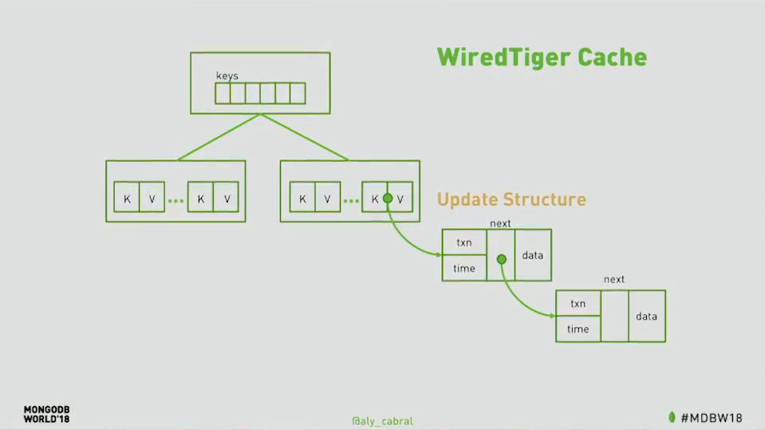
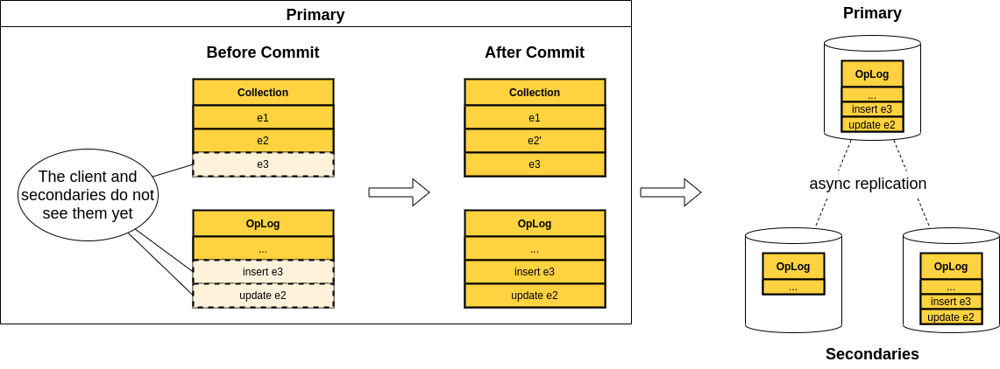

# MongoDB Transactions

---

## What is a transaction?

*"A transaction is a logical unit of work that contains one or more SQL statements. A transaction is an atomic unit. The effects of all the SQL statements in a transaction can be either all committed (applied to the database) or all rolled back (undone from the database)."*

<a style="font-size:0.4em; float: right" href="https://docs.oracle.com/cd/B19306_01/server.102/b14220/transact.htm">Oracle, Transaction management <a/>

---

## Do I really need them in a NoSQL DBMS?
* Resource-demanding and very slow compared to non-transactional operations <!-- .element: class="fragment fade-in-then-semi-out" data-fragment-index="1" -->
* In NoSQL applications we can generally find a way around ACID requirements by: <!-- .element: class="fragment" data-fragment-index="2" -->
  * Allowing temporary issues - Social media <!-- .element: style="color: white" class="fragment fade-in-then-semi-out" data-fragment-index="3" -->
  * Optimistic/Pessimistic concurrency control - Airplane Ticketing and online shops<!-- .element: class="fragment fade-in-then-semi-out" data-fragment-index="4" -->
  * Transaction-less approach - Ebay <!-- .element: class="fragment fade-in-then-semi-out" data-fragment-index="5" -->

---

### You need them less than you think...

What if I need to update many accounts of the same user **atomically**?

<pre class="code-wrapper" style>
    <code class="hljs dts">// Users
{
    _id: 1,
    email: x
}
// Accounts
{
    _id: 1,
    userId: 1
}
{
    _id: 2,
    userId: 1
}</code>
</pre>

    <code>updateMany() ❌</code>

<pre style="flex: 1" class="code-wrapper" style>
    <code class="hljs dts">// Users
 
{
    _id: 1,
    email: x,
    accounts: [
        {
            _id: 1
        },
        {
            _id: 2
        }
    ]
}</code>
</pre>

    <code>updateOne() ✅</code>

---

### Finally, transactions in MongoDB

* Introduced in version 4.0 but limited to the same replica set, from 4.2 extended to the whole cluster <!-- .element: class="fragment fade-in-then-semi-out" data-fragment-index="1" -->
* Designed to be very similar to SQL transactions <!-- .element: class="fragment fade-in-then-semi-out" data-fragment-index="2" -->
* They guarantee ACID properties, but how? <!-- .element: class="fragment fade-in-then-semi-out" data-fragment-index="3" -->

---

## Atomicity 

*"Atomicity guarantees that all of the commands that make up the transaction are treated as a single unit, and succeed, or fail, together"* <!-- .element: class="fragment fade-in-then-semi-out" data-fragment-index="1" -->

* WiredTiger snapshot <!-- .element: class="fragment fade-in-then-semi-out" data-fragment-index="2" -->
* Sessions <!-- .element: class="fragment fade-in-then-semi-out" data-fragment-index="2" -->

---

### WiredTiger Cache

---

### Sessions

- A transaction is always associated to only one session <!-- .element: class="fragment fade-in-then-semi-out" data-fragment-index="1" -->
- Each session has a LSID (Logical Session Identifier) composed of Guid + hash(username, SHA256) <!-- .element: class="fragment fade-in-then-semi-out" data-fragment-index="2" -->
- They are necessary for the transaction management and clean-up <!-- .element: class="fragment fade-in-then-semi-out" data-fragment-index="3" -->

---

## Lifecycle of a transaction

    

        
    

    

        <ol>
            <li class="fragment fade-in-then-semi-out">You start a transaction (in the primary)</li>
            <li class="fragment fade-in-then-semi-out">The oplog is updated with all operations performed</li>
            <li class="fragment fade-in-then-semi-out">You commit the transaction and both the changes and the oplog entries are now visible</li>
            <li class="fragment fade-in-then-semi-out">Now the replication phase can start asynchronously</li>
        </ol>
    

---

## Consistency

*"Consistency guarantees that changes made within a transaction are consistent with constraints in effect on the database (like uniqueness of a value for a given key in documents in a collection)."*

---

## Isolation

*"Isolation guarantees that concurrently executed transactions do not affect each other's outcomes"*<!-- .element: class="fragment fade-in-then-semi-out" data-fragment-index="1" -->

The only available isolation level is <code>Snapshot</code>, but are you completely safe from concurrency issues?

---

### Snapshot Isolation

A snapshot is a point in time that reflects only the prior writes

***
| snapshots  |   |   |   | 1 |   |   |   | 2 |   |   |
|------------|---|---|---|---|---|---|---|---|---|---|
|   writes   | 1 | 2 | 3 |   | 4 | 5 | 6 |   | 7 | 8 |
***

It is an optimistic MultiVersion Concurrency Control (MVCC) strategy <!-- .element: class="fragment fade-in-then-semi-out" data-fragment-index="1" -->

---

<!-- .slide: style="font-size: 25px" -->
### Dirty Reads

*A transaction is allowed to read data from a row that has been modified by another running transaction and not yet committed*

| time| t1 | t2 |
|-----|----|----|
| 0 | `SELECT age FROM users WHERE id = 1; /* will read 20 */` | |                                      
| 1 |                                                          | `UPDATE users SET age = 21 WHERE id = 1; /* No commit here */` |
| 2 | `SELECT age FROM users WHERE id = 1; /* will read 21 */` | |
| 3 |                                                          | `ROLLBACK; /* lock-based DIRTY READ */` |

---

<!-- .slide: style="font-size: 25px" -->
### Non-Repeatable Reads
*During the course of a transaction, a row is retrieved twice and the values within the row differ between reads*

| time | t1 | t2 |
|------|----|----|
| 0 | `SELECT * FROM users WHERE id = 1;`                     | |                                      
| 1 |                                                         | `UPDATE users SET age = 21 WHERE id = 1; COMMIT;` |
| 2 | `SELECT * FROM users WHERE id = 1; COMMIT;` | |

---

<!-- .slide: style="font-size: 25px" -->
### Phantom Reads
*New rows are added or removed by another transaction to the records being read*

| time | t1 | t2 |
|------|----|----|
| 0 | `SELECT * FROM users WHERE age BETWEEN 10 AND 30;` | |
| 1 |                                                    | `INSERT INTO users(id, name, age) VALUES (3, 'Bob', 27); COMMIT;` |
| 2 | `SELECT * FROM users WHERE age BETWEEN 10 AND 30; COMMIT;` | |

---

## Snapshot Pros & Cons

- ✅ You will never experience the described issues <!-- .element: class="fragment fade-in-then-semi-out" data-fragment-index="1" -->
- ✅ Maximum level of concurrency, BUT... <!-- .element: class="fragment fade-in-then-semi-out" data-fragment-index="2" -->
- ❌ With the possibility of conflicts <!-- .element: class="fragment fade-in-then-semi-out" data-fragment-index="3" -->
- ❌ Transactional updates lock documents until the transaction commits <!-- .element: class="fragment fade-in-then-semi-out" data-fragment-index="4" -->