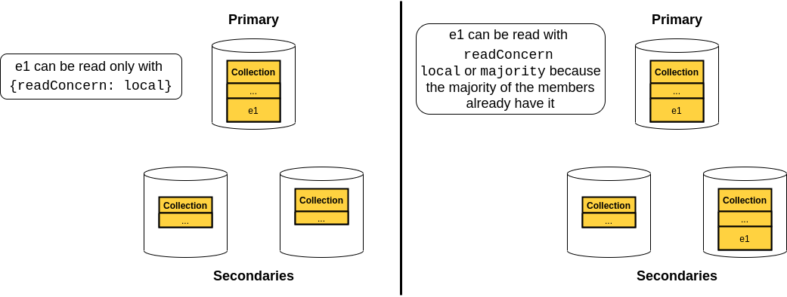
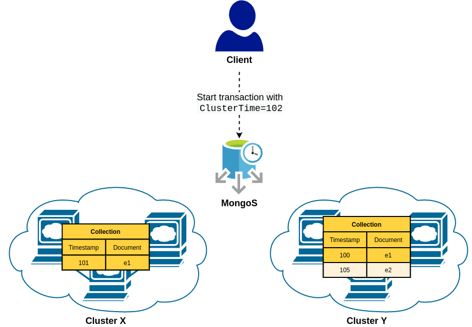

# MongoDB Transactions

---

## What is a transaction?

*"A transaction is a logical unit of work that contains one or more SQL statements. A transaction is an atomic unit. The effects of all the SQL statements in a transaction can be either all committed (applied to the database) or all rolled back (undone from the database)."*

<a style="font-size:0.4em; float: right" href="https://docs.oracle.com/cd/B19306_01/server.102/b14220/transact.htm">Oracle, Transaction management <a/>

---

## Do I really need them in a NoSQL DBMS?
* Resource-demanding and very slow compared to non-transactional operations <!-- .element: class="fragment fade-in-then-semi-out" data-fragment-index="1" -->
* In NoSQL applications we can generally find a way around ACID requirements by: <!-- .element: class="fragment" data-fragment-index="2" -->
  * Allowing temporary issues - Social media <!-- .element: style="color: white" class="fragment fade-in-then-semi-out" data-fragment-index="3" -->
  * Optimistic/Pessimistic concurrency control - Airplane Ticketing and online shops<!-- .element: class="fragment fade-in-then-semi-out" data-fragment-index="4" -->
  * Transaction-less approach - Ebay <!-- .element: class="fragment fade-in-then-semi-out" data-fragment-index="5" -->

---

### You need them less than you think...

What if I need to update many accounts of the same user **atomically**?

<div style="display: flex; gap: 5%; font-size: 25px">
<div style="flex: 1">
<pre class="code-wrapper" style>
    <code class="hljs dts">// Users
{
    _id: 1,
    email: x
}
// Accounts
{
    _id: 1,
    userId: 1
}
{
    _id: 2,
    userId: 1
}</code>
</pre>
<div class="fragment" data-fragment-index="1">
    <code>updateMany() ❌</code>
</div>
</div>

<div style="flex: 1">
<pre style="flex: 1" class="code-wrapper" style>
    <code class="hljs dts">// Users
 
{
    _id: 1,
    email: x,
    accounts: [
        {
            _id: 1
        },
        {
            _id: 2
        }
    ]
}</code>
</pre>
<div class="fragment" data-fragment-index="1">
    <code>updateOne() ✅</code>
</div>
</div>
</div>

---

### Finally, transactions in MongoDB

* Introduced in version 4.0 but limited to the same replica set, from 4.2 extended to the whole cluster <!-- .element: class="fragment fade-in-then-semi-out" data-fragment-index="1" -->
* Designed to be very similar to SQL transactions <!-- .element: class="fragment fade-in-then-semi-out" data-fragment-index="2" -->
* They guarantee ACID properties, but how? <!-- .element: class="fragment fade-in-then-semi-out" data-fragment-index="3" -->

---

## Atomicity 

*"Atomicity guarantees that all of the commands that make up the transaction are treated as a single unit, and succeed, or fail, together"* <!-- .element: class="fragment fade-in-then-semi-out" data-fragment-index="1" -->

* WiredTiger snapshot <!-- .element: class="fragment fade-in-then-semi-out" data-fragment-index="2" -->
* Sessions <!-- .element: class="fragment fade-in-then-semi-out" data-fragment-index="2" -->

---

### WiredTiger Cache


---

### Sessions

- A transaction is always associated to only one session <!-- .element: class="fragment fade-in-then-semi-out" data-fragment-index="1" -->
- Each session has a LSID (Logical Session Identifier) composed of Guid + hash(username, SHA256) <!-- .element: class="fragment fade-in-then-semi-out" data-fragment-index="2" -->
- They are necessary for the transaction management and clean-up <!-- .element: class="fragment fade-in-then-semi-out" data-fragment-index="3" -->

---

## Lifecycle of a transaction

<div style="display: flex; gap: 1%; font-size: 15px">
    <div style="flex: 5">
        
    </div>
    <div style="flex: 1">
        <ol>
            <li class="fragment fade-in-then-semi-out">You start a transaction (in the primary)</li>
            <li class="fragment fade-in-then-semi-out">The oplog is updated with all operations performed</li>
            <li class="fragment fade-in-then-semi-out">You commit the transaction and both the changes and the oplog entries are now visible</li>
            <li class="fragment fade-in-then-semi-out">Now the replication phase can start asynchronously</li>
        </ol>
    </div>
</div>

---

## Consistency

*"Consistency guarantees that changes made within a transaction are consistent with constraints in effect on the database (like uniqueness of a value for a given key in documents in a collection)."*

---

## Isolation

*"Isolation guarantees that concurrently executed transactions do not affect each other's outcomes"*<!-- .element: class="fragment fade-in-then-semi-out" data-fragment-index="1" -->

<p class="fragment fade-in-then-semi-out">The only available isolation level is <code>Snapshot</code>, but are you completely safe from concurrency issues?</p>

---

### Snapshot Isolation

A snapshot is a point in time that reflects only the prior writes

***
| snapshots  |   |   |   | 1 |   |   |   | 2 |   |   |
|------------|---|---|---|---|---|---|---|---|---|---|
|   writes   | 1 | 2 | 3 |   | 4 | 5 | 6 |   | 7 | 8 |
***

It is an optimistic MultiVersion Concurrency Control (MVCC) strategy <!-- .element: class="fragment fade-in-then-semi-out" data-fragment-index="1" -->

---

<!-- .slide: style="font-size: 25px" -->
### Dirty Reads

*A transaction is allowed to read data from a row that has been modified by another running transaction and not yet committed*

| time| t1 | t2 |
|-----|----|----|
| 0 | `SELECT age FROM users WHERE id = 1; /* will read 20 */` | |                                      
| 1 |                                                          | `UPDATE users SET age = 21 WHERE id = 1; /* No commit here */` |
| 2 | `SELECT age FROM users WHERE id = 1; /* will read 21 */` | |
| 3 |                                                          | `ROLLBACK; /* lock-based DIRTY READ */` |

---

<!-- .slide: style="font-size: 25px" -->
### Non-Repeatable Reads
*During the course of a transaction, a row is retrieved twice and the values within the row differ between reads*

| time | t1 | t2 |
|------|----|----|
| 0 | `SELECT * FROM users WHERE id = 1;`                     | |                                      
| 1 |                                                         | `UPDATE users SET age = 21 WHERE id = 1; COMMIT;` |
| 2 | `SELECT * FROM users WHERE id = 1; COMMIT;` | |

---

<!-- .slide: style="font-size: 25px" -->
### Phantom Reads
*New rows are added or removed by another transaction to the records being read*

| time | t1 | t2 |
|------|----|----|
| 0 | `SELECT * FROM users WHERE age BETWEEN 10 AND 30;` | |
| 1 |                                                    | `INSERT INTO users(id, name, age) VALUES (3, 'Bob', 27); COMMIT;` |
| 2 | `SELECT * FROM users WHERE age BETWEEN 10 AND 30; COMMIT;` | |

---

## Snapshot Pros & Cons

- ✅ You will never experience the described issues <!-- .element: class="fragment fade-in-then-semi-out" data-fragment-index="1" -->
- ✅ Maximum level of concurrency, BUT... <!-- .element: class="fragment fade-in-then-semi-out" data-fragment-index="2" -->
- ❌ With the possibility of conflicts <!-- .element: class="fragment fade-in-then-semi-out" data-fragment-index="3" -->
- ❌ Transactional updates lock documents until the transaction commits <!-- .element: class="fragment fade-in-then-semi-out" data-fragment-index="4" -->

---

## *"Distributed"* Isolation

Locally, every node uses the Snapshot Isolation, but what data should be read in a distributed environment? 

- Some documents might be stored only in the primary with the risk of losing them in case of crash <!-- .element: class="fragment fade-in-then-semi-out" data-fragment-index="1" -->
- What about distributed transactions? How to take a consistent snapshot among nodes? <!-- .element: class="fragment fade-in-then-semi-out" data-fragment-index="2" -->

---

## `ReadConcern`

<ul>
    <li class="fragment fade-in-then-semi-out" data-fragment-index="1">
        <code>local</code>: you can read everything stored in the primary
    </li>
    <li class="fragment fade-in-then-semi-out" data-fragment-index="2">
        <code>majority</code>: you can only read data acknowledged by a majority of the replica set (must commit with <code>{w: majority}</code>)
    </li>
    <li class="fragment fade-in-then-semi-out" data-fragment-index="3">
        <code>snapshot</code>: the transaction sees a point in time snapshot of majority-committed data... 🤔
    </li>
</ul>

<p class="fragment fade-in-then-semi-out" data-fragment-index="4">Let's start with the first two `ReadConcern`s</p>

---

## **`local`** vs **`majority`**



---

## **`snapshot`** Readconcern

By using `local` or `majority`, you get consistent snapshot per replica set, wherease with `snapshot` read concern all the shards take a snapshot at the same `ClusterTime` 

you must commit with `{w: majority}`

---

### What is the `ClusterTime`?

Every node has an internal clock, synchronized with the others in the cluster using an HLC (Hybrid Logical Clock) <!-- .element: class="fragment fade-in-then-semi-out" data-fragment-index="1" -->

<p>This clock is called <code>ClusterTime</code> and composed of <code>&lt;Time&gt;&lt;Increment&gt;</code></p> <!-- .element: class="fragment fade-in-then-semi-out" data-fragment-index="2" -->

<p>Every node and clients track and include the <code>ClusterTime</code> when sending a message, but is incremented only after a write</p> <!-- .element: class="fragment fade-in-then-semi-out" data-fragment-index="3" -->

---



---

## Durability

*"Once the database has told the client it has written the data, that data has in fact been written to a backing store and will persist even in the case of a system failure."*

Again, we are in a distributed system, what does *durable* mean?

---

### `WriteConcern`

Describes the level of acknowledgement when a transaction commits, composed of:

<ul>
    <li class="fragment fade-in-then-semi-out" data-fragment-index="1">
        <code>w</code>: transactional changes must have been replicated on the specified number of members (<code>0</code>, <code>1</code>, <code>majority</code>, ...)
    </li>
    <li class="fragment fade-in-then-semi-out" data-fragment-index="2">
        <code>j</code>: boolean value specifying whether the ACK should be sent after operations are written to the on-disk journal
    </li>
    <li class="fragment fade-in-then-semi-out" data-fragment-index="3">
        <code>wtimeout</code>: timeout after which the transaction is considered failed.
    </li>
</ul>

---

## Distributed Transactions

What if a transaction spans over multiple shards?

<div style="display: flex; gap: 5%">
    <div style="flex: 1">
        
    </div>
    <div style="flex: 1; display: flex; align-items: center;">
        <ul>
            <li class="fragment fade-in-then-semi-out">Client</li>
            <li class="fragment fade-in-then-semi-out"><code>mongos</code> instance</li>
            <li class="fragment fade-in-then-semi-out">Shards</li>
        </ul>
    </div>
</div>

---

## Distributed Transactions (Part 2)

- The client starts the transaction, that goes through the mongos router <!-- .element: class="fragment fade-in-then-semi-out" data-fragment-index="1" -->
- The first shard contacted becomes the coordinator <!-- .element: class="fragment fade-in-then-semi-out" data-fragment-index="2" -->
- At commit point, the coordinator makes sure the other shards are ready and finally they all commit <!-- .element: class="fragment fade-in-then-semi-out" data-fragment-index="3" -->

This is called 2-phase commit. <!-- .element: class="fragment fade-in-then-semi-out" data-fragment-index="4" -->

---

### Behind the scenes...

The Coordinator Oplog is enriched with additional information

```json [1-16|5-8|9|11-14]
{
    "op": "i",
    "o": {
        "_id": {
            "lsid": {
                "id": UUID("..."),
                "uid": BinData("...")
            },
            "txnNumber": NumberLong(0)
        },
        "participants": [
            "Transaction-shard-0",
            "Transaction-shard-1"
        ]
    }
}
```

---

Every transactional oplog entry (on all shards) stores the state of an operation

```json [1-16|4-12|13]
{
    "op": "c",
    "o": {
        "applyOps": [
            {
                "op": "u",
                "ns": "test.demo",
                "ui": UUID("..."),
                "o": { ... } // the command executed
                "o2": { ... } // target documents
            }
        ],
        "prepare": true
    }
}
```

---

In the end, if all shards are ready, then the coordinator sends the commit message

```json [1-13|7-10]
{
        ...
        "participants": [
            "Transaction-shard-0",
            "Transaction-shard-1"
        ],
        "decision": {
            "decision": "commit",
            "commitTimestamp": Timestamp(...)
        }
    }
}
```